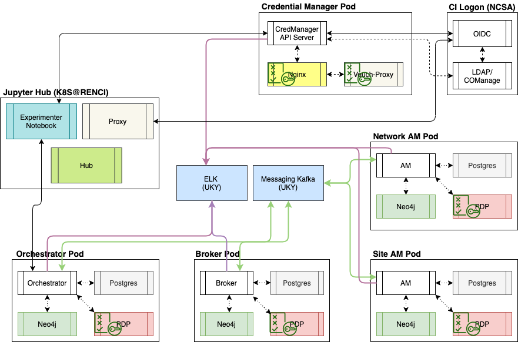

[](https://requires.io/github/fabric-testbed/ControlFramework/requirements/?branch=master)

[](https://pypi.org/project/fabric-cf/)

# Control Framework
This repository contains Fabric Control Framework and Actor implementations.

## Overview
Fabric Control Framework has 3 actors
- Controller
- Broker
- Aggregate Manager

## Broker
Broker is an agent of CF that collects resource availability information from multiple aggregate managers and can make resource promises on their behalf. More details can be found [here](fabric_cf/broker/Readme.md)

## Aggregate Manager
AM is a CF agent responsible for managing aggregate resources. Is under the control of the owner of the aggregate. Provides promises of resources to brokers and controllers/ orchestrators. More details can be found [here](fabric_cf/authority/Readme.md)

## Orchestrator
Orchestrator is an agent of CF that makes allocation decisions (embedding) of user requests into available resources. Communicates with user to collect slice requests, communicates with broker or aggregate managers to collect resource promises, communicates with aggregate managers to provision promised resources. Creates slices, configures resources, maintains their state, modifies slices and slivers. More details can be found [here](fabric_cf/orchestrator/README.md)

## Architecture
The following diagram depicts an overall architecture for the Control Framework.


## Requirements
Python 3.9+

## Build Docker Images

### Authority Docker Image
```
docker build -f Dockerfile-auth -t authority .
```

### Broker Docker Image
```
docker build -f Dockerfile-broker -t broker .
```

### Orchestrator Docker Image
```
docker build -f Dockerfile-orchestrator -t orchestrator .
```

## Configuration pre-requisites
- Kafka Configuration
  - Request topic, consumer and producer credentials for each Actor from [Song](ywsong2@g.uky.edu) 
  - Request Hosts running the Actors to be added to Kafka Brokers and Schema Registry Firewall
  - Make sure to configure consumer.group.id different for each actor
