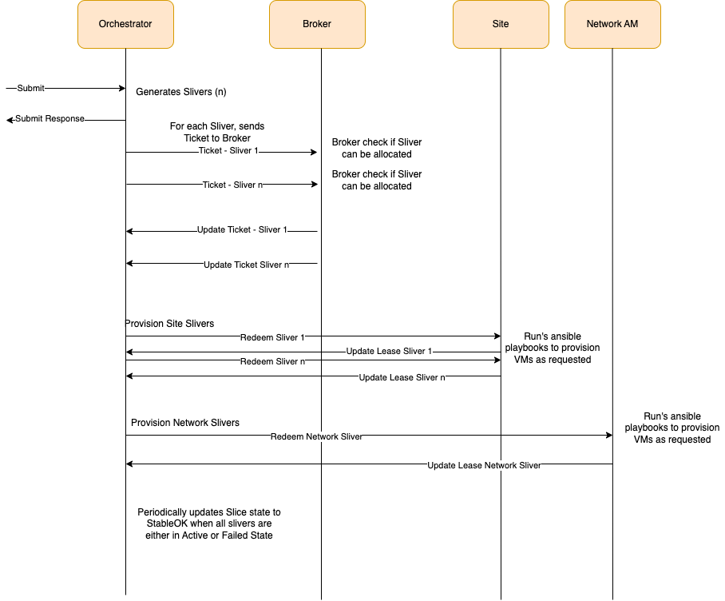

# Design
## Sequence Diagram 
The following diagram depicts the flow of messages for a single slice create.

## Create Slice
This section captures the complete flow of a simple Create Slice Request provisioning a single VM with couple of PCI 
devices.
### Orchestrator
Complete Flow for all messages and processing at Orchestrator is described below:
- Incoming REST API for slice operations is handled by `slices_controller` which invokes `OrchestratorHandler::create_slice`
- `OrchestratorHandler::create_slice` processes incoming Create Slice as follows:
  - Validate the Lease End time; compute it to 24 hours if not specified
  - Active Slice exists already with the same name for the user; Return failure
  - Load Slice graph into Neo4j and validate; Return Failure if validation fails
  - Add Slice to the Controller and create OrchestratorSliceWrapper object for the slice
  - Invoke `OrchestratorSliceWrapper::create`
    - Build Reservations for Node Slivers
    - Build Reservations for Network Service Slivers and dependencies to the corresponding parent Node Reservations
      - Get Mapping information for Interface Sliver from ASM i.e. [Peer IFS, Peer NS Id, Component Name, Node Id]
      - Set capacities (bw in Gbps, burst size is in Mbits) source: (b)
      - Set Labels  
      - Save the parent component name and the parent reservation id in the Node Map
    - Add Reservations to the Slice
    - Demand the computed reservations(add them to policy) for NetworkNode/NetworkService Slivers
  - Responds back to REST API with the list of computed reservations 
- Actor Tick Handler Thread 
   - Checking for Pending Reservations
   - Ticket message exchange with broker
     - For NetworkServices: 
       - check for any predecessors i.e. NetworkNode reservations to be Ticketed
       - If not ticketed, reservation is moved to BlockedTicket state
       - If failed, fail the reservation
       - Else, 
         - Update BQM Node and Component Id in Node Map
         `NOTE-1: This is Used by Broker to set vlan - source: (c), local_name source: (a), 
          NSO device name source: (a) - need to find the owner switch of the network service in CBM and take its 
         .name or labels.local_name`
         - For shared NICs grab the MAC & VLAN from corresponding Interface Sliver maintained in the Parent 
           Reservation Sliver and update Interface Slivers
         - Trigger Kafka ticket exchange with broker
     - For NetworkNode:
       - Trigger Kafka ticket exchange with broker
   - Redeem message exchange with AM once ticket is granted by Broker

### Broker
Complete Flow for all messages and processing at Broker is described below:
- `Broker::ticket` validates the incoming message and adds it to bids_pending queue
- `Broker::tick_handler` processes the messages from bids_pending queue
  - Invokes `KernelWrapper::ticket` which does following
    - Registers Reservation
    - Reserve the reservation by invoking `BrokerSimplerUnitsPolicy::ticket_inventory` which is responsible for annotating 
    the reservation by querying CBM and Relational Database and updating the reservation
      - Node Slivers [`BrokerSimplerUnitsPolicy::____allocate_nodes`]
        - Find candidate nodes from BQM for the site requested which have the requested components
        - User First Fit Algorithm as follows to determine a BQM node which satisfies the request
          - For each candidate
            - Check requested capacities can be satisfied using the values in Capacity Delegations and excluding any values assigned to active Reservations
            - Check requested components can be satisfied using the available components and excluding already assigned components
              - For Shared NIC cards; also find the MAC, VLAN Tag and also update the Interface Sliver
        - Grant a ticket by Sending Update Ticket Message to Orchestrator
          - Update Ticket: Success if node found to satisfy request else with Failure indicating the Insufficient Resources
        - Update ReservationInfo in the CBM for the Graph Node to include Reservation Id and Slice Id
      - Network Service Slivers [`BrokerSimplerUnitsPolicy::__allocate_services`]
        - For each Interface Sliver;
          - Fetch Network Node Id and BQM Component Id
          - Get BQM Connection Point in Site Delegation (c)
          - Get BQM Peer Connection Point in Site Delegation (a)
          - VLAN is already set by the Orchestrator using the information from the Node Sliver Parent Reservation
          - Set vlan - source: (c) - only for dedicated NICs
          - local_name source: (a)
          - Set the NSO device-name: NSO device name source: (a) - need to find the owner switch of the network service in CBM and take its .name or labels.local_name.
          - Update the Interface Sliver Node Map to map to (a)
          - Update the Network Service Sliver Node Map to map to parent of (a)
    - Send Updated Reservation back to Orchestrator  

### Aggregate Manager
Complete Flow for all messages and processing at AM is described below:
- Incoming Redeem Message is processed by `Authority::redeem` method which in turn results in following sequence 
- `KernelWrapper::redeem_request`
  - validates the incoming message
  - registers the reservation
  - reserves the reservation by invoking `Kernel::reserve`
    - Invokes the AuthorityCalendarPolicy::bind which validates the incoming reservation, leases, resources requested; if successful adds it to the redeeming queue and to the calendar
- `Authority::tick_handler` periodically checks for the reservations which need to be assigned resources and invokes `AuthorityCalendarPolicy::assign_reservation`:
- Looks the ResourceControl based on the resource type and invokes it's assign method
  e.g. ResourceType=VM, `NetworkNodeControl::assign` is invoked
  - Node Slivers
    - Lookup graph node in ARM using the graph_node_id received in the reservation
    - Check allocated node capacities can be satisfied
    - Redeem Reservation
  - Network Service Slivers
- Assign method for each ResourceControl Looks up ARM and verifies the availability of the assigned resource
  for the specific resource type; Updates the Reservation in database
- Invokes the Handler via Plugin to provision the resource on the Substrate
- Handler on completion; updates the status of the reservation which in turn is passed to the Broker and Orchestrator
