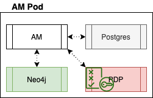
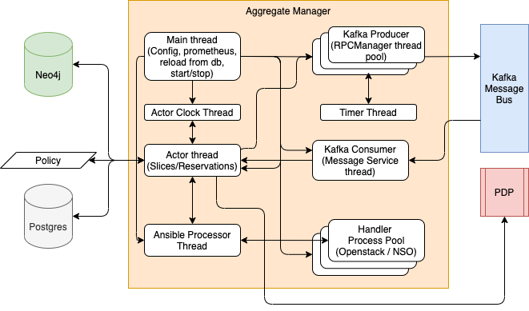

# Aggregate Manager
An aggregate manager(AM) controls access to the substrate components. It controls some set of infrastructure resources in a particular site consisting of a set of servers, storage units, network elements or other components under common ownership and control. AMs inform brokers about available resources by passing to the resource advertisement information models. AMs may be associated with more than one broker and the partitioning of resources between brokers is the decision left to the AM. Oversubscription is possible, depending on the deployment needs.
FABRIC enables a substrate provider to outsource resource arbitration and calendar scheduling to a broker. By delegating resources to the broker, the AM consents to the broker’s policies, and agrees to try to honor reservations issued by the broker if the user has authorization on the AM. 

Besides, common code each AM type has specific plugins that determine its resource allocation behavior (Resource Management Policy) and the specific actions it takes to provision a sliver (Resource Handler). Both plugins are invoked by AM common core code based on the resource type or type of request being considered. More information on AM handlers can be found [here](https://github.com/fabric-testbed/AMHandlers).

AM runs as a set of four container depicted in the picture below.


- AM: runs the Control Framework AM
- Postgres: database maintains slices and reservation information
- Neo4j: Aggregate Substrate information i.e. Aggregate Resource Model is maintained in Neo4j
- PDP: Policy Definition point used by AM to authorize user requests

An overview of AM thread model is shown below:


- Main : spawns all threads, loads config, starts prometheus exporter
- Actor Clock : delivers a periodic event to Actor Main thread based on the time interval configured 
- Actor : Kernel thread responsible for processing various requested operations on slices/reservations
- Kafka Producer : Thread pool responsible for sending outgoing messages from AM over Kafka
- Timer : Timer thread to timeout requests such as claim
- Kafka Consumer : Consumer thread responsible for processing incoming messages for AM over Kafka
- Ansible Processor : Responsible for invoking Handler depending on the resource type
- Handler Process pool : Process pool for running handler ansible scripts

## Configuration
`config.site.am.yaml` depicts an example config file for an Aggregate Manager.
### Pre-requisites
- Kafka Configuration
  - Request topic, consumer and producer credentials for each Actor from [Song](ywsong2@g.uky.edu)
  - Request Hosts running the Actors to be added to Kafka Brokers and Schema Registry Firewall
  - Make sure to configure consumer.group.id different for each actor

## Deployment
Aggregate Manager must deploy following containers:
- Neo4j
- Postgres Database
- Policy Enforcement Function 
- Authority

`docker-compose.yml` file present in this directory brings up all the required containers

### Setup Aggregate Manager
Run the `setup.sh` script to set up an Aggregate Manager. User is expected to specify following parameters:
- Directory name for AM
- Neo4j Password to be used
- Path to the config file for AM
- Path to Aggregate Resource Model i.e. graphml
- Path to Handler Config File

```
./setup.sh site1-am password ./config.site.am.yaml ../../neo4j/RENCI-ad.graphml ./vm_handler_config.yml
```

For GENI racks, use the following command instead:
```
/setup.sh uky2-am password ./config.site.am.geni.yaml ../../neo4j/UKY2.graphml ./vm_handler_config.yml ./vnic_net_handler_config.yml
```

For Network AM, use the following command instead:
```
./setup.sh net-am password ./config.net.am.yaml ../../neo4j/Network-ad.graphml ./net_handler_config.yml
```

For AL2S AM, use the following command instead:
```
./setup.sh al2s-am password ./config.al2s.am.yaml ../../neo4j/AL2S.graphml ./al2s_handler_config.yml
```

### Environment and Configuration
The script `setup.sh` generates directory for the AM, which has `.env` file which contains Environment variables for `docker-compose.yml` to use
User is expected to update `.env` file as needed and update volumes section for am in `docker-compose.yml`.

Following files must be checked to update any of the parameters
1. Clone AMHandlers [github repo](https://github.com/fabric-testbed/AMHandlers.git), and set up the configuration as listed [here](https://github.com/fabric-testbed/AMHandlers/blob/main/README.md)
1. `.env` from [env.template](env.template) - Environment variables for `docker-compose.yml` to use
2. `config.yaml` updated to reflect the correct information

#### .env
Modify the default values for each to correspond to your desired deployment. The UID and GID based entries should correspond to the values of the user responsible for running the code as these will relate to shared volumes from the host to the running containers.
NOTE: bolt, http and https ports for Neo4J should be changed when launching multiple CF Actors on same host

```
# docker-compose environment file
#
# When you set the same environment variable in multiple files,
# here’s the priority used by Compose to choose which value to use:
#
#  1. Compose file
#  2. Shell environment variables
#  3. Environment file
#  4. Dockerfile
#  5. Variable is not defined

# Neo4J configuration
NEO4J_DATA_PATH_DOCKER=/data
NEO4J_DATA_PATH_HOST=./neo4j/data
NEO4J_GID=1000
NEO4J_HOST=neo4j
NEO4J_IMPORTS_PATH_DOCKER=/imports
NEO4J_IMPORTS_PATH_HOST=./neo4j/imports
NEO4J_LOGS_PATH_DOCKER=/logs
NEO4J_LOGS_PATH_HOST=./neo4j/logs
NEO4J_PASS=password
NEO4J_UID=1000
NEO4J_USER=neo4j
NEO4J_dbms_connector_bolt_advertised__address=0.0.0.0:7687
NEO4J_dbms_connector_bolt_listen__address=0.0.0.0:7687
NEO4J_dbms_connector_http_advertised__address=0.0.0.0:7474
NEO4J_dbms_connector_http_listen__address=0.0.0.0:7474
NEO4J_dbms_connector_https_advertised__address=0.0.0.0:7473
NEO4J_dbms_connector_https_listen__address=0.0.0.0:7473

# postgres configuration
POSTGRES_HOST=database
POSTGRES_PORT=5432
POSTGRES_USER=fabric
POSTGRES_PASSWORD=fabric
PGDATA=/var/lib/postgresql/data/pgdata
POSTGRES_DB=am

PDP_NEW_CONF_PATH_HOST=./pdp/conf
PDP_NEW_POLICIES_PATH_HOST=./pdp/policies
PDP_GID=1000
PDP_UID=1000
```
#### config.yaml
The parameters depicted below must be checked/updated before bring any of the containers up.
```
runtime:
  kafka-server:
  kafka-schema-registry-url:
  kafka-key-schema: /etc/fabric/message_bus/schema/key.avsc
  kafka-value-schema: /etc/fabric/message_bus/schema/message.avsc
  kafka-ssl-ca-location:  /etc/fabric/message_bus/ssl/cacert.pem
  kafka-ssl-certificate-location:  /etc/fabric/message_bus/ssl/client.pem
  kafka-ssl-key-location:  /etc/fabric/message_bus/ssl/client.key
  kafka-ssl-key-password:
  kafka-security-protocol: SSL
  kafka-group-id:
  kafka-sasl-mechanism:
  kafka-sasl-producer-username:
  kafka-sasl-producer-password:
  kafka-sasl-consumer-username:
  kafka-sasl-consumer-password:
  prometheus.port: 11000

logging:
  ## The directory in which actor should create log files.
  ## This directory will be automatically created if it does not exist.
  log-directory: /var/log/actor

  ## The filename to be used for actor's log file.
  log-file: actor.log

  ## The default log level for actor.
  log-level: DEBUG

  ## actor rotates log files. You may specify how many archived log files to keep here.
  log-retain: 5

  ## actor rotates log files after they exceed a certain size.
  ## You may specify the file size that results in a log file being rotated here.
  log-size: 5000000

  logger: site1-am

oauth:
  jwks-url: https://cm.fabric-testbed.net/certs
  # Uses HH:MM:SS (less than 24 hours)
  key-refresh: 00:10:00
  verify-exp: True

database:
  db-user: fabric
  db-password: fabric
  db-name: am
  db-host: localhost:5432

container:
  container.guid: site1-am-conainer

time:
  # This section controls settings, which are generally useful
  # when running under emulation. These settings allow you to
  # control notion of time.

  # Beginning of time (in unix time).
  # The default is -1, which translates into using the current time as
  # the beginning of time for the container's internal clock.
  time.startTime: -1

  # Internal tick length (in milliseconds)
  time.cycleMillis: 1000
  # The number of the first tick
  time.firstTick: 0

  # This property controls if time advances automatically (false) or
  # manually (true)
  time.manual: false

pdp:
  url: http://localhost:8080/services/pdp
  enable: True

neo4j:
  url: bolt://localhost:7687
  user: neo4j
  pass: password
  import_host_dir: /usr/src/app/neo4j/imports/
  import_dir: /imports

actor:
  type: authority
  name: site1-am
  guid: site1-am-guid
  description: Site AM
  kafka-topic: site1-am-topic
  substrate.file: /etc/fabric/actor/config/neo4j/arm.graphml
  policy:
      module: fabric_cf.actor.core.policy.authority_calendar_policy
      class: AuthorityCalendarPolicy
  resources:
      - resource:
          type: VM
          label: VM AM
          description: VM AM
          handler:
            module: fabric_am.handlers.vm_handler
            class: VMHandler
            properties:
              config.properties.file: /etc/fabric/actor/config/vm_handler_config.yml
  controls:
      - control:
          type: VM, Container, Baremetal
          module: fabric_cf.actor.core.policy.network_node_control
          class: NetworkNodeControl
peers:
  - peer:
      name: orchestrator
      type: orchestrator
      guid: orchestrator-guid
      kafka-topic: orchestrator-topic
  - peer:
      name: broker
      type: broker
      guid: broker-guid
      kafka-topic: broker-topic
      delegation: primary
```
#### Aggregate Manager Container (am)
Update `docker-compose.yml` to point to correct volumes for the AM. 
**IMPORTANT**: When deploying AM on Headnode, use `network_mode: host` instead of container network.

```
    volumes:
      - ./neo4j:/usr/src/app/neo4j
      - ./config.yaml:/etc/fabric/actor/config/config.yaml
      - ./arm.graphml:/etc/fabric/actor/config/neo4j/arm.graphml
      - ./logs/:/var/log/actor
      - ./vm_handler_config.yml:/etc/fabric/actor/config/vm_handler_config.yml
      - ../../../../AMHandlers/fabric_am/playbooks:/etc/fabric/actor/playbooks
      - ../../../../AMHandlers/fabric_am/playbooks/inventory:/etc/fabric/actor/playbooks/inventory
      - ./ssh:/root/.ssh
      - ../../../secrets/snakeoil-ca-1.crt:/etc/fabric/message_bus/ssl/cacert.pem
      - ../../../secrets/kafkacat1.client.key:/etc/fabric/message_bus/ssl/client.key
      - ../../../secrets/kafkacat1-ca1-signed.pem:/etc/fabric/message_bus/ssl/client.pem
      #- ./state_recovery.lock:/usr/src/app/state_recovery.lock
```
##### Stateful Restart
For the stateful restart, uncomment the `- ./state_recovery.lock:/usr/src/app/state_recovery.lock` from volumes section of Aggregate Manager container. After this `am` container can be stopped, removed and recreated in a stateful manner. However, it is required that neo4j and database containers are not removed and retain the state.
```
docker-compose stop am
docker-compose rm -fv am
```
### Run
Bring up PDP container
```
cd site1-am
docker-compose up -d pdp
```
Check for PDP container logs
```
docker logs site1-am-pdp
/
/

  .   ____          _            __ _ _
 /\\ / ___'_ __ _ _(_)_ __  __ _ \ \ \ \
( ( )\___ | '_ | '_| | '_ \/ _` | \ \ \ \
 \\/  ___)| |_)| | | | | || (_| |  ) ) ) )
  '  |____| .__|_| |_|_| |_\__, | / / / /
 =========|_|==============|___/=/_/_/_/
 :: Spring Boot ::       (v1.5.14.RELEASE)

2020-11-02 16:48:15.571  INFO 9 --- [           main] ationConfigEmbeddedWebApplicationContext : Refreshing org.springframework.boot.context.embedded.AnnotationConfigEmbeddedWebApplicationContext@6bf2d08e: startup date [Mon Nov 02 16:48:15 GMT 2020]; root of context hierarchy
2020-11-02 16:48:16.054  INFO 9 --- [           main] o.s.b.f.xml.XmlBeanDefinitionReader      : Loading XML bean definitions from URL [file:/conf/spring-beans.xml]
2020-11-02 16:48:16.382  INFO 9 --- [           main] o.s.b.f.xml.XmlBeanDefinitionReader      : Loading XML bean definitions from class path resource [META-INF/cxf/cxf.xml]
2020-11-02 16:48:16.398  INFO 9 --- [           main] o.s.b.f.s.DefaultListableBeanFactory     : Overriding bean definition for bean 'org.apache.cxf.bus.spring.BusWiringBeanFactoryPostProcessor' with a different definition: replacing [Root bean: class [org.apache.cxf.bus.spring.BusWiringBeanFactoryPostProcessor]; scope=; abstract=false; lazyInit=false; autowireMode=0; dependencyCheck=0; autowireCandidate=true; primary=false; factoryBeanName=null; factoryMethodName=null; initMethodName=null; destroyMethodName=null] with [Generic bean: class [org.apache.cxf.bus.spring.BusWiringBeanFactoryPostProcessor]; scope=; abstract=false; lazyInit=false; autowireMode=0; dependencyCheck=0; autowireCandidate=true; primary=false; factoryBeanName=null; factoryMethodName=null; initMethodName=null; destroyMethodName=null; defined in class path resource [META-INF/cxf/cxf.xml]]
2020-11-02 16:48:17.392  INFO 9 --- [           main] s.b.c.e.t.TomcatEmbeddedServletContainer : Tomcat initialized with port(s): 8080 (http)
2020-11-02 16:48:17.534  INFO 9 --- [ost-startStop-1] o.s.web.context.ContextLoader            : Root WebApplicationContext: initialization completed in 1968 ms
2020-11-02 16:48:17.889  INFO 9 --- [ost-startStop-1] o.s.b.w.servlet.ServletRegistrationBean  : Mapping servlet: 'dispatcherServlet' to [/]
2020-11-02 16:48:17.890  INFO 9 --- [ost-startStop-1] o.s.b.w.servlet.ServletRegistrationBean  : Mapping servlet: 'CXFServlet' to [/services/*]
2020-11-02 16:48:17.893  INFO 9 --- [ost-startStop-1] o.s.b.w.servlet.FilterRegistrationBean   : Mapping filter: 'characterEncodingFilter' to: [/*]
2020-11-02 16:48:17.894  INFO 9 --- [ost-startStop-1] o.s.b.w.servlet.FilterRegistrationBean   : Mapping filter: 'hiddenHttpMethodFilter' to: [/*]
2020-11-02 16:48:17.894  INFO 9 --- [ost-startStop-1] o.s.b.w.servlet.FilterRegistrationBean   : Mapping filter: 'httpPutFormContentFilter' to: [/*]
2020-11-02 16:48:17.894  INFO 9 --- [ost-startStop-1] o.s.b.w.servlet.FilterRegistrationBean   : Mapping filter: 'requestContextFilter' to: [/*]
2020-11-02 16:48:19.543  INFO 9 --- [           main] s.w.s.m.m.a.RequestMappingHandlerAdapter : Looking for @ControllerAdvice: org.springframework.boot.context.embedded.AnnotationConfigEmbeddedWebApplicationContext@6bf2d08e: startup date [Mon Nov 02 16:48:15 GMT 2020]; root of context hierarchy
2020-11-02 16:48:19.637  INFO 9 --- [           main] s.w.s.m.m.a.RequestMappingHandlerMapping : Mapped "{[/error],produces=[text/html]}" onto public org.springframework.web.servlet.ModelAndView org.springframework.boot.autoconfigure.web.BasicErrorController.errorHtml(javax.servlet.http.HttpServletRequest,javax.servlet.http.HttpServletResponse)
2020-11-02 16:48:19.638  INFO 9 --- [           main] s.w.s.m.m.a.RequestMappingHandlerMapping : Mapped "{[/error]}" onto public org.springframework.http.ResponseEntity<java.util.Map<java.lang.String, java.lang.Object>> org.springframework.boot.autoconfigure.web.BasicErrorController.error(javax.servlet.http.HttpServletRequest)
2020-11-02 16:48:19.680  INFO 9 --- [           main] o.s.w.s.handler.SimpleUrlHandlerMapping  : Mapped URL path [/webjars/**] onto handler of type [class org.springframework.web.servlet.resource.ResourceHttpRequestHandler]
2020-11-02 16:48:19.680  INFO 9 --- [           main] o.s.w.s.handler.SimpleUrlHandlerMapping  : Mapped URL path [/**] onto handler of type [class org.springframework.web.servlet.resource.ResourceHttpRequestHandler]
2020-11-02 16:48:19.730  INFO 9 --- [           main] o.s.w.s.handler.SimpleUrlHandlerMapping  : Mapped URL path [/**/favicon.ico] onto handler of type [class org.springframework.web.servlet.resource.ResourceHttpRequestHandler]
2020-11-02 16:48:19.968  INFO 9 --- [           main] o.s.j.e.a.AnnotationMBeanExporter        : Registering beans for JMX exposure on startup
2020-11-02 16:48:20.012  INFO 9 --- [           main] s.b.c.e.t.TomcatEmbeddedServletContainer : Tomcat started on port(s): 8080 (http)
```
Shutdown PDP container and replace the `pdp.xml` in `pdp/conf` directory
```
docker-compose stop pdp
cp ../pdp.xml pdp/conf/
```
Bring up all the required containers
```
docker-compose up -d
```
