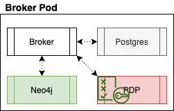
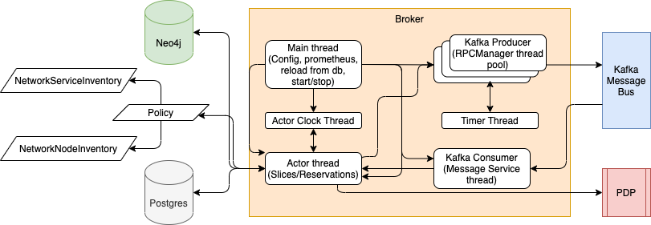

# Broker
Broker(s) collect substrate advertisement information models (delegations) from AMs, aggregate them together and make them available to orchestrator(s) via a query interface. They also issue reservations for resources to orchestrators to be redeemed at appropriate AMs.

Broker runs as a set of four container depicted in the picture below.


- Broker: runs the Control Framework Broker
- Postgres: database maintains slices and reservation information
- Neo4j: Combined Substrate information from all the aggregates i.e. Combined Broker Model is maintained in Neo4j
- PDP: Policy Definition point used by Broker to authorize user requests

An overview of Broker thread model is shown below:


- Main : spawns all threads, loads config, starts prometheus exporter
- Actor Clock : delivers a periodic event to Actor Main thread based on the time interval configured 
- Actor : Kernel thread responsible for processing various requested operations on slices/reservations
- Kafka Producer : Thread pool responsible for sending outgoing messages from AM over Kafka
- Timer : Timer thread to timeout requests such as claim
- Kafka Consumer : Consumer thread responsible for processing incoming messages for AM over Kafka

Broker is the core of the Control Framework and is responsible for allocating resources to the requested reservations. 
This allocation is done by Broker policy i.e. `BrokerSimplerUnitsPolicy` based on the resource type i.e. NetworkNode or NetworkService.
Allocation for each resource type is handled by the respective Inventory classes as indicated in the diagram.

## Configuration
`config.site.broker.yaml` depicts an example config file for a Broker.
### Pre-requisites
- Kafka Configuration
  - Request topic, consumer and producer credentials for each Actor from [Song](ywsong2@g.uky.edu)
  - Request Hosts running the Actors to be added to Kafka Brokers and Schema Registry Firewall
  - Make sure to configure consumer.group.id different for each actor
    
## Deployment
Broker must deploy following containers:
- Neo4j
- Postgres Database
- Policy Enforcement Function
- Broker

`docker-compose.yml` file present in this directory brings up all the required containers

### Setup Broker
Run the `setup.sh` script to set up a Broker. User is expected to specify following parameters:
- Directory name for Broker
- Neo4j Password to be used
- Path to the config file for Broker

```
./setup.sh broker password ./config.broker.yaml
```
### Environment and Configuration

The script `setup.sh` generates directory for the Broker, which has `.env` file which contains Environment variables for `docker-compose.yml` to use
User is expected to update `.env` file as needed and update volumes section for broker in `docker-compose.yml`.

Following files must be checked to update any of the parameters
1. `.env` from [env.template](env.template) - Environment variables for `docker-compose.yml` to use
2. `config.yaml` updated to reflect the correct information

#### .env
Modify the default values for each to correspond to your desired deployment. The UID and GID based entries should correspond to the values of the user responsible for running the code as these will relate to shared volumes from the host to the running containers.
NOTE: bolt, http and https ports for Neo4J should be changed when launching multiple CF Actors on same host

```
# docker-compose environment file
#
# When you set the same environment variable in multiple files,
# here’s the priority used by Compose to choose which value to use:
#
#  1. Compose file
#  2. Shell environment variables
#  3. Environment file
#  4. Dockerfile
#  5. Variable is not defined

# Neo4J configuration
NEO4J_DATA_PATH_DOCKER=/data
NEO4J_DATA_PATH_HOST=./neo4j/data
NEO4J_GID=1000
NEO4J_HOST=neo4j
NEO4J_IMPORTS_PATH_DOCKER=/imports
NEO4J_IMPORTS_PATH_HOST=./neo4j/imports
NEO4J_LOGS_PATH_DOCKER=/logs
NEO4J_LOGS_PATH_HOST=./neo4j/logs
NEO4J_PASS=password
NEO4J_UID=1000
NEO4J_USER=neo4j
NEO4J_dbms_connector_bolt_advertised__address=0.0.0.0:8687
NEO4J_dbms_connector_bolt_listen__address=0.0.0.0:8687
NEO4J_dbms_connector_http_advertised__address=0.0.0.0:8474
NEO4J_dbms_connector_http_listen__address=0.0.0.0:8474
NEO4J_dbms_connector_https_advertised__address=0.0.0.0:8473
NEO4J_dbms_connector_https_listen__address=0.0.0.0:8473

# postgres configuration
POSTGRES_HOST=database
POSTGRES_PORT=5432
POSTGRES_USER=fabric
POSTGRES_PASSWORD=fabric
PGDATA=/var/lib/postgresql/data/pgdata
POSTGRES_DB=broker

PDP_NEW_CONF_PATH_HOST=./pdp/conf
PDP_NEW_POLICIES_PATH_HOST=./pdp/policies
PDP_GID=1000
PDP_UID=1000
```
#### config.yaml
The parameters depicted below must be checked/updated before bring any of the containers up.
```
runtime:
  kafka-server:
  kafka-schema-registry-url:
  kafka-key-schema: /etc/fabric/message_bus/schema/key.avsc
  kafka-value-schema: /etc/fabric/message_bus/schema/message.avsc
  kafka-ssl-ca-location:  /etc/fabric/message_bus/ssl/cacert.pem
  kafka-ssl-certificate-location:  /etc/fabric/message_bus/ssl/client.pem
  kafka-ssl-key-location:  /etc/fabric/message_bus/ssl/client.key
  kafka-ssl-key-password:
  kafka-security-protocol: SSL
  kafka-group-id:
  kafka-sasl-mechanism:
  kafka-sasl-producer-username:
  kafka-sasl-producer-password:
  kafka-sasl-consumer-username:
  kafka-sasl-consumer-password:
  prometheus.port: 11000

logging:
  ## The directory in which actor should create log files.
  ## This directory will be automatically created if it does not exist.
  log-directory: /var/log/actor

  ## The filename to be used for actor's log file.
  log-file: actor.log

  ## The default log level for actor.
  log-level: DEBUG

  ## actor rotates log files. You may specify how many archived log files to keep here.
  log-retain: 5

  ## actor rotates log files after they exceed a certain size.
  ## You may specify the file size that results in a log file being rotated here.
  log-size: 5000000

  logger: broker

oauth:
  jwks-url: https://cm.fabric-testbed.net/certs
  # Uses HH:MM:SS (less than 24 hours)
  key-refresh: 00:10:00
  verify-exp: True

database:
  db-user: fabric
  db-password: fabric
  db-name: broker
  db-host: broker-db:5432

container:
  container.guid: broker-conainer

time:
  # This section controls settings, which are generally useful
  # when running under emulation. These settings allow you to
  # control notion of time.

  # Beginning of time (in unix time).
  # The default is -1, which translates into using the current time as
  # the beginning of time for the container's internal clock.
  time.startTime: -1

  # Internal tick length (in milliseconds)
  time.cycleMillis: 1000

  # The number of the first tick
  time.firstTick: 0

  # This property controls if time advances automatically (false) or
  # manually (true)
  time.manual: false

pdp:
  url: http://broker-pdp:8080/services/pdp
  enable: True

neo4j:
  url: bolt://broker-neo4j:8687
  user: neo4j
  pass: password
  import_host_dir: /usr/src/app/neo4j/imports/
  import_dir: /imports

bqm:
  kafka-topic: broker-resource-usage
    # in seconds (default set to 2 hours)
  publish-interval: 7200
  kafka-sasl-producer-username:
  kafka-sasl-producer-password:

actor:
  type: broker
  name: broker
  guid: broker-guid
  description: Broker
  kafka-topic: broker-topic
  policy:
      module: fabric_cf.actor.core.policy.broker_simpler_units_policy
      class: BrokerSimplerUnitsPolicy
      properties:
        algorithm: FirstFit
  controls:
      - control:
          type: VM, Container, Baremetal
          class: NetworkNodeInventory
          module: fabric_cf.actor.core.policy.network_node_inventory

peers:
  - peer:
      name: orchestrator
      type: orchestrator
      guid: orchestrator-guid
      kafka-topic: orchestrator-topic
  - peer:
      name: net1-am
      guid: net1-am-guid
      type: authority
      kafka-topic: net1-am-topic
  - peer:
      name: site1-am
      guid: site1-am-guid
      type: authority
      kafka-topic: site1-am-topic
```
#### broker
Update `docker-compose.yml` to point to correct volumes for the Broker.

```
    volumes:
      - ./neo4j:/usr/src/app/neo4j
      - ./config.yaml:/etc/fabric/actor/config/config.yaml
      - ./logs/:/var/log/actor
      - ../../../secrets/snakeoil-ca-1.crt:/etc/fabric/message_bus/ssl/cacert.pem
      - ../../../secrets/kafkacat1.client.key:/etc/fabric/message_bus/ssl/client.key
      - ../../../secrets/kafkacat1-ca1-signed.pem:/etc/fabric/message_bus/ssl/client.pem
      #- ./state_recovery.lock:/usr/src/app/state_recovery.lock
```
##### Stateful Restart
For the stateful restart, uncomment the `- ./state_recovery.lock:/usr/src/app/state_recovery.lock` from volumes section of Broker container. After this `broker` container can be stopped, removed and recreated in a stateful manner. However, it is required that neo4j and database containers are not removed and retain the state.
```
docker-compose stop broker
docker-compose rm -fv broker
```
### Run
Bring up PDP container
```
cd broker
docker-compose up -d pdp
```
Check for PDP container logs
```
docker logs broker-pdp
/
/

  .   ____          _            __ _ _
 /\\ / ___'_ __ _ _(_)_ __  __ _ \ \ \ \
( ( )\___ | '_ | '_| | '_ \/ _` | \ \ \ \
 \\/  ___)| |_)| | | | | || (_| |  ) ) ) )
  '  |____| .__|_| |_|_| |_\__, | / / / /
 =========|_|==============|___/=/_/_/_/
 :: Spring Boot ::       (v1.5.14.RELEASE)

2020-11-02 16:48:15.571  INFO 9 --- [           main] ationConfigEmbeddedWebApplicationContext : Refreshing org.springframework.boot.context.embedded.AnnotationConfigEmbeddedWebApplicationContext@6bf2d08e: startup date [Mon Nov 02 16:48:15 GMT 2020]; root of context hierarchy
2020-11-02 16:48:16.054  INFO 9 --- [           main] o.s.b.f.xml.XmlBeanDefinitionReader      : Loading XML bean definitions from URL [file:/conf/spring-beans.xml]
2020-11-02 16:48:16.382  INFO 9 --- [           main] o.s.b.f.xml.XmlBeanDefinitionReader      : Loading XML bean definitions from class path resource [META-INF/cxf/cxf.xml]
2020-11-02 16:48:16.398  INFO 9 --- [           main] o.s.b.f.s.DefaultListableBeanFactory     : Overriding bean definition for bean 'org.apache.cxf.bus.spring.BusWiringBeanFactoryPostProcessor' with a different definition: replacing [Root bean: class [org.apache.cxf.bus.spring.BusWiringBeanFactoryPostProcessor]; scope=; abstract=false; lazyInit=false; autowireMode=0; dependencyCheck=0; autowireCandidate=true; primary=false; factoryBeanName=null; factoryMethodName=null; initMethodName=null; destroyMethodName=null] with [Generic bean: class [org.apache.cxf.bus.spring.BusWiringBeanFactoryPostProcessor]; scope=; abstract=false; lazyInit=false; autowireMode=0; dependencyCheck=0; autowireCandidate=true; primary=false; factoryBeanName=null; factoryMethodName=null; initMethodName=null; destroyMethodName=null; defined in class path resource [META-INF/cxf/cxf.xml]]
2020-11-02 16:48:17.392  INFO 9 --- [           main] s.b.c.e.t.TomcatEmbeddedServletContainer : Tomcat initialized with port(s): 8080 (http)
2020-11-02 16:48:17.534  INFO 9 --- [ost-startStop-1] o.s.web.context.ContextLoader            : Root WebApplicationContext: initialization completed in 1968 ms
2020-11-02 16:48:17.889  INFO 9 --- [ost-startStop-1] o.s.b.w.servlet.ServletRegistrationBean  : Mapping servlet: 'dispatcherServlet' to [/]
2020-11-02 16:48:17.890  INFO 9 --- [ost-startStop-1] o.s.b.w.servlet.ServletRegistrationBean  : Mapping servlet: 'CXFServlet' to [/services/*]
2020-11-02 16:48:17.893  INFO 9 --- [ost-startStop-1] o.s.b.w.servlet.FilterRegistrationBean   : Mapping filter: 'characterEncodingFilter' to: [/*]
2020-11-02 16:48:17.894  INFO 9 --- [ost-startStop-1] o.s.b.w.servlet.FilterRegistrationBean   : Mapping filter: 'hiddenHttpMethodFilter' to: [/*]
2020-11-02 16:48:17.894  INFO 9 --- [ost-startStop-1] o.s.b.w.servlet.FilterRegistrationBean   : Mapping filter: 'httpPutFormContentFilter' to: [/*]
2020-11-02 16:48:17.894  INFO 9 --- [ost-startStop-1] o.s.b.w.servlet.FilterRegistrationBean   : Mapping filter: 'requestContextFilter' to: [/*]
2020-11-02 16:48:19.543  INFO 9 --- [           main] s.w.s.m.m.a.RequestMappingHandlerAdapter : Looking for @ControllerAdvice: org.springframework.boot.context.embedded.AnnotationConfigEmbeddedWebApplicationContext@6bf2d08e: startup date [Mon Nov 02 16:48:15 GMT 2020]; root of context hierarchy
2020-11-02 16:48:19.637  INFO 9 --- [           main] s.w.s.m.m.a.RequestMappingHandlerMapping : Mapped "{[/error],produces=[text/html]}" onto public org.springframework.web.servlet.ModelAndView org.springframework.boot.autoconfigure.web.BasicErrorController.errorHtml(javax.servlet.http.HttpServletRequest,javax.servlet.http.HttpServletResponse)
2020-11-02 16:48:19.638  INFO 9 --- [           main] s.w.s.m.m.a.RequestMappingHandlerMapping : Mapped "{[/error]}" onto public org.springframework.http.ResponseEntity<java.util.Map<java.lang.String, java.lang.Object>> org.springframework.boot.autoconfigure.web.BasicErrorController.error(javax.servlet.http.HttpServletRequest)
2020-11-02 16:48:19.680  INFO 9 --- [           main] o.s.w.s.handler.SimpleUrlHandlerMapping  : Mapped URL path [/webjars/**] onto handler of type [class org.springframework.web.servlet.resource.ResourceHttpRequestHandler]
2020-11-02 16:48:19.680  INFO 9 --- [           main] o.s.w.s.handler.SimpleUrlHandlerMapping  : Mapped URL path [/**] onto handler of type [class org.springframework.web.servlet.resource.ResourceHttpRequestHandler]
2020-11-02 16:48:19.730  INFO 9 --- [           main] o.s.w.s.handler.SimpleUrlHandlerMapping  : Mapped URL path [/**/favicon.ico] onto handler of type [class org.springframework.web.servlet.resource.ResourceHttpRequestHandler]
2020-11-02 16:48:19.968  INFO 9 --- [           main] o.s.j.e.a.AnnotationMBeanExporter        : Registering beans for JMX exposure on startup
2020-11-02 16:48:20.012  INFO 9 --- [           main] s.b.c.e.t.TomcatEmbeddedServletContainer : Tomcat started on port(s): 8080 (http)
```
Shutdown PDP container and replace the `pdp.xml` in `pdp/conf` directory
```
docker-compose stop pdp
cp ../pdp.xml pdp/conf/
```
Bring up all the required containers
```
docker-compose up -d
```
