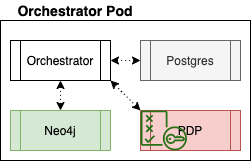
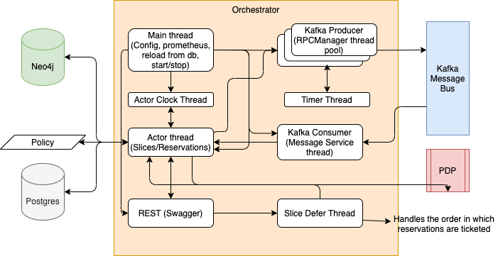

# Orchestrator
The Orchestrator component is responsible for mapping the resources requested by an experimenter onto appropriate FABRIC resources (i.e., experiment or measurement resources).  The Orchestrator component learns about potential resources in FABRIC from one or more Brokers.

It exposes a North Bound user facing REST APIs to allow user to send their provisioning requests. It talks to Broker and AMs via Kafka based Message Bus.

Orchestrator runs as a set of four container depicted in the picture below.


- Orchestrator: runs the Control Framework Orchestrator
- Postgres: database maintains slices and reservation information
- Neo4j: Slice graphs i.e Abstract Slice Model (ASM)s are maintained in Neo4j. Broker Query Model i.e. BQM is also maintained in Neo4j 
- PDP: Policy Definition point used by Orchestrator to authorize user requests

An overview of Orchestrator thread model is shown below:


- Main : spawns all threads, loads config, starts prometheus exporter
- Actor Clock : delivers a periodic event to Actor Main thread based on the time interval configured 
- Actor : Kernel thread responsible for processing various requested operations on slices/reservations
- REST (Swagger) : Handles the REST APIs. More details can be found in the sections below.
- Kafka Producer : Thread pool responsible for sending outgoing messages from AM over Kafka
- Timer : Timer thread to timeout requests such as claim
- Kafka Consumer : Consumer thread responsible for processing incoming messages for AM over Kafka
- Slice Defer Thread: Responsible for handling dependencies between reservations and order in which the reservations are ticketed

## North Bound REST Interface
This is implemented as Swagger based REST Server. This swagger server was generated by the [swagger-codegen](https://github.com/swagger-api/swagger-codegen) project. By using the [OpenAPI-Spec](https://github.com/swagger-api/swagger-core/wiki) from a remote server, you can easily generate a server stub.  This
is an example of building a swagger-enabled Flask server.

Orchestrator uses the [Connexion](https://github.com/zalando/connexion) library on top of Flask.

### API
API Documentation can be found [here](https://app.swaggerhub.com/apis-docs/kthare10/orchestrator/1.0.0)

#### Version

The Orchestrator API is versioned based on the release found in GitHub.

API `version`:

Resource | Action | Input | Output
:--------|:----:|:---:|:---:
`/version` | GET: current API version | NA | Version format

Example: Version format

```json
{
  "data": [
    null
  ],
  "size": 1,
  "status": 200,
  "type": "string"
}
```
#### Resources
All the resources available on Fabric Testbed can be queried.

API `/resources`:
 
Resource | Action | Input | Output
:--------|:----:|:---:|:---:
`/` | GET: Retrieve a listing and description of available resources| | JSON Object which contains the Graph ML describing the resources

Example: Resources format
```json
{
  "data": [
    {}
  ],
  "size": 1,
  "status": 200,
  "type": "string"
}
```

### Slivers
Sliver is an individually programmable or configurable resource provisioned on a single aggregate. Slivers are provisioned by aggregates at the request of Orchestrators. Each sliver belongs to one and only one slice. The following APIs allow operations on Slivers.

API `/slivers`:
 
Resource | Action | Input | Output
:--------|:----:|:---:|:---:
`/` | GET: Retrieve a listing of user slivers | `slice_id` Slice ID | Sliver Format
`/{sliver_id}` | GET: Retrieve Sliver properties | `slice_id` Slice ID, `sliver_id` Sliver ID | Sliver Format

Example: Sliver format
```json
{
  "data": [
    {
      "sliver_type": "string",
      "sliver": {},
      "lease_start_time": "string",
      "lease_end_time": "string",
      "state": "string",
      "pending_state": "string",
      "join_state": "string",
      "graph_node_id": "string",
      "slice_id": "string",
      "sliver_id": "string"
    }
  ],
  "size": 1,
  "status": 200,
  "type": "string"
}
```

### Slices
Slice is a collection of logically-related resources representing a single execution of an experiment (or a portion of an experiment, as multiple slices may be involved). Typically represents a connected topology of resources known as slivers. A slice is part of one and only one project. The following APIs allow operations on Slices.

API `/slices`:
 
Resource | Action | Input | Output
:--------|:----:|:---:|:---:
`/` | GET: Retrieve a listing of user slices |  | Slice Format
`/{slice_id}` | GET: Retrieve Slice properties | `slice_id` Slice ID | Slice Format
`/create` | POST: Request to create slice as described in the request. Request would be a graph ML describing the requested resources. Resources may be requested to be created now or in future. On success, one or more slivers are allocated, containing resources satisfying the request, and assigned to the given slice. This API returns list and description of the resources reserved for the slice in the form of Graph ML. Orchestrator would also trigger provisioning of these resources asynchronously on the appropriate sites either now or in the future as requested. Experimenter can invoke get slice API to get the latest state of the requested resources. | `sliceName` Slice Name, `sshKey` SSH Key, `leaseEndTime` Lease End Time, `GraphML Representing the Slice` body | Slice Format
`/renew/{slice_id}` | POST: Request to extend slice be renewed with their expiration extended. If possible, the orchestrator should extend the slivers to the requested expiration time, or to a sooner time if policy limits apply. | `slice_id` Slice ID, `newLeaseEndTime` New Lease End Time for the Slice | Slice Format
`/delete/{slice_id}` | DELETE: Request to delete slice. On success, resources associated with slice or sliver are stopped if necessary, de-provisioned and un-allocated at the respective sites. | `slice_id` Slice ID | Slice Format
`/delete` | DELETE: Request to delete all slices of a user within a project. Email and Project Id information is available in the token. | | Slice Format

Example: Slice format
```json
{
  "data": [
    {
      "model": "string",
      "lease_end_time": "string",
      "state": "string",
      "graph_id": "string",
      "name": "string",
      "slice_id": "string"
    }
  ],
  "limit": 0,
  "links": null,
  "offset": 0,
  "size": 0,
  "status": 200,
  "total": 0,
  "type": "string"
}
```

### Swagger Server
The swagger server was generated by the [swagger-codegen](https://github.com/swagger-api/swagger-codegen) project. By using the
[OpenAPI-Spec](https://github.com/swagger-api/swagger-core/wiki) from a remote server, you can easily generate a server stub.  

Orchestrator uses the [Connexion](https://github.com/zalando/connexion) library on top of Flask.

### Generate a new server stub
In a browser, go to [Swagger definition](https://app.swaggerhub.com/apis/kthare10/orchestrator/1.0.0)

From the generate code icon (downward facing arrow), select Download API > JSON Resolved

A file named kthare10-orchestrator-1.0.0-resolved.json should be downloaded. Rename it as openapi.json and copy it to `ControlFramework/fabric_cf/orchestrator`. Run the following command to generate the Flask based server.

```bash
$ cp kthare10-orchestrator-1.0.0-resolved.json openapi.json
$ ./update_swagger_stub.sh
```
Remove existing swagger_server directory and move my_server/swagger_server to swagger_server after verifying all changes are as expected.

## Configuration
`config.site.orchestrator.yaml` depicts an example config file for an Orchestrator.
### Pre-requisites
- Kafka Configuration
  - Request topic, consumer and producer credentials for each Actor from [Song](ywsong2@g.uky.edu)
  - Request Hosts running the Actors to be added to Kafka Brokers and Schema Registry Firewall
  - Make sure to configure consumer.group.id different for each actor
    
## Deployment
Orchestrator must deploy following containers:
- Neo4j
- Postgres Database
- Policy Enforcement Function
- Orchestrator

`docker-compose.yml` file present in this directory brings up all the required containers

### Setup Orchestrator
Run the `setup.sh` script to set up a Orchestrator. User is expected to specify following parameters:
- Directory name for Orchestrator
- Neo4j Password to be used
- Path to the config file for Orchestrator

```
./setup.sh orchestrator password ./config.orchestrator.yaml
```

### Environment and Configuration

The script `setup.sh` generates directory for the Orchestrator, which has `.env` file which contains Environment variables for `docker-compose.yml` to use
User is expected to update `.env` file as needed and update volumes section for am in `docker-compose.yml`.

Following files must be checked to update any of the parameters
1. `.env` from [env.template](env.template) - Environment variables for `docker-compose.yml` to use
2. `config.yaml` updated to reflect the correct information

#### .env
Modify the default values for each to correspond to your desired deployment. The UID and GID based entries should correspond to the values of the user responsible for running the code as these will relate to shared volumes from the host to the running containers.
NOTE: bolt, http and https ports for Neo4J should be changed when launching multiple CF Actors on same host

```
# docker-compose environment file
#
# When you set the same environment variable in multiple files,
# here’s the priority used by Compose to choose which value to use:
#
#  1. Compose file
#  2. Shell environment variables
#  3. Environment file
#  4. Dockerfile
#  5. Variable is not defined

# Neo4J configuration
NEO4J_DATA_PATH_DOCKER=/data
NEO4J_DATA_PATH_HOST=./neo4j/data
NEO4J_GID=1000
NEO4J_HOST=neo4j
NEO4J_IMPORTS_PATH_DOCKER=/imports
NEO4J_IMPORTS_PATH_HOST=./neo4j/imports
NEO4J_LOGS_PATH_DOCKER=/logs
NEO4J_LOGS_PATH_HOST=./neo4j/logs
NEO4J_PASS=password
NEO4J_UID=1000
NEO4J_USER=neo4j
NEO4J_dbms_connector_bolt_advertised__address=0.0.0.0:9687
NEO4J_dbms_connector_bolt_listen__address=0.0.0.0:9687
NEO4J_dbms_connector_http_advertised__address=0.0.0.0:9474
NEO4J_dbms_connector_http_listen__address=0.0.0.0:9474
NEO4J_dbms_connector_https_advertised__address=0.0.0.0:9473
NEO4J_dbms_connector_https_listen__address=0.0.0.0:9473

# postgres configuration
POSTGRES_HOST=database
POSTGRES_PORT=5432
POSTGRES_USER=fabric
POSTGRES_PASSWORD=fabric
PGDATA=/var/lib/postgresql/data/pgdata
POSTGRES_DB=orchestrator

PDP_NEW_CONF_PATH_HOST=./pdp/conf
PDP_NEW_POLICIES_PATH_HOST=./pdp/policies
PDP_GID=1000
PDP_UID=1000
```
#### config.yaml
The parameters depicted below must be checked/updated before bring any of the containers up.
```
runtime:
  kafka-server:
  kafka-schema-registry-url:
  kafka-key-schema: /etc/fabric/message_bus/schema/key.avsc
  kafka-value-schema: /etc/fabric/message_bus/schema/message.avsc
  kafka-ssl-ca-location:  /etc/fabric/message_bus/ssl/cacert.pem
  kafka-ssl-certificate-location:  /etc/fabric/message_bus/ssl/client.pem
  kafka-ssl-key-location:  /etc/fabric/message_bus/ssl/client.key
  kafka-ssl-key-password:
  kafka-security-protocol: SSL
  kafka-group-id:
  kafka-sasl-mechanism:
  kafka-sasl-producer-username:
  kafka-sasl-producer-password:
  kafka-sasl-consumer-username:
  kafka-sasl-consumer-password:
  orchestrator.rest.port: 8700
  prometheus.port: 11000

logging:
  ## The directory in which actor should create log files.
  ## This directory will be automatically created if it does not exist.
  log-directory: /var/log/actor

  ## The filename to be used for actor's log file.
  log-file: actor.log

  ## The default log level for actor.
  log-level: DEBUG

  ## actor rotates log files. You may specify how many archived log files to keep here.
  log-retain: 5

  ## actor rotates log files after they exceed a certain size.
  ## You may specify the file size that results in a log file being rotated here.
  log-size: 5000000

  logger: orchestrator

oauth:
  jwks-url: https://cm.fabric-testbed.net/certs
  # Uses HH:MM:SS (less than 24 hours)
  key-refresh: 00:10:00
  verify-exp: True

database:
  db-user: fabric
  db-password: fabric
  db-name: orchestrator
  db-host: orchestrator-db:5432

pdp:
  url: http://orchestrator-pdp:8080/services/pdp
  enable: True

neo4j:
  url: bolt://orchestrator-neo4j:9687
  user: neo4j
  pass: password
  import_host_dir: /usr/src/app/neo4j/imports/
  import_dir: /imports

container:
  container.guid: orchestrator-conainer

bqm:
  # in seconds (default set to 300 seconds)
  refresh-interval: 300 seconds

time:
  # This section controls settings, which are generally useful
  # when running under emulation. These settings allow you to
  # control notion of time.

  # Beginning of time (in unix time).
  # The default is -1, which translates into using the current time as
  # the beginning of time for the container's internal clock.
  time.startTime: -1

  # Internal tick length (in milliseconds)
  time.cycleMillis: 1000

  # The number of the first tick
  time.firstTick: 0

  # This property controls if time advances automatically (false) or
  # manually (true)
  time.manual: false

actor:
  type: orchestrator
  name: orchestrator
  guid: orchestrator-guid
  description: orchestrator
  kafka-topic: orchestrator-topic
  policy:
      module: fabric_cf.actor.core.policy.controller_ticket_review_policy
      class: ControllerTicketReviewPolicy
peers:
  - peer:
      name: broker
      type: broker
      guid: broker-guid
      kafka-topic: broker-topic
  - peer:
      name: net1-am
      guid: net1-am-guid
      type: authority
      kafka-topic: net1-am-topic
  - peer:
      name: site1-am
      guid: site1-am-guid
      type: authority
      kafka-topic: site1-am-topic
```

#### orchestrator
Update `docker-compose.yml` to point to correct volumes for the Orchestrator.

```
    volumes:
      - ./neo4j:/usr/src/app/neo4j
      - ./config.yaml:/etc/fabric/actor/config/config.yaml
      - ./logs/:/var/log/actor
      - ../../../secrets/snakeoil-ca-1.crt:/etc/fabric/message_bus/ssl/cacert.pem
      - ../../../secrets/kafkacat1.client.key:/etc/fabric/message_bus/ssl/client.key
      - ../../../secrets/kafkacat1-ca1-signed.pem:/etc/fabric/message_bus/ssl/client.pem
      #- ./state_recovery.lock:/usr/src/app/state_recovery.lock
```
##### Stateful Restart
For the stateful restart, uncomment the `- ./state_recovery.lock:/usr/src/app/state_recovery.lock` from volumes section of Orchestrator container. After this `orchestrator` container can be stopped, removed and recreated in a stateful manner. However, it is required that neo4j and database containers are not removed and retain the state.
```
docker-compose stop orchestrator
docker-compose rm -fv orchestrator
```

#### nginx
Update `docker-compose.yml` to point to correct volumes for the nginx.
```
    volumes:
      - ./nginx/default.conf:/etc/nginx/conf.d/default.conf
      - ./certs/fullchain.pem:/etc/ssl/public.pem
      - ./certs/privkey.pem:/etc/ssl/private.pem
```

### Run
Bring up PDP container
```
cd orchestrator
docker-compose up -d pdp
```
Check for PDP container logs
```
docker logs orchestrator-pdp
/
/

  .   ____          _            __ _ _
 /\\ / ___'_ __ _ _(_)_ __  __ _ \ \ \ \
( ( )\___ | '_ | '_| | '_ \/ _` | \ \ \ \
 \\/  ___)| |_)| | | | | || (_| |  ) ) ) )
  '  |____| .__|_| |_|_| |_\__, | / / / /
 =========|_|==============|___/=/_/_/_/
 :: Spring Boot ::       (v1.5.14.RELEASE)

2020-11-02 16:48:15.571  INFO 9 --- [           main] ationConfigEmbeddedWebApplicationContext : Refreshing org.springframework.boot.context.embedded.AnnotationConfigEmbeddedWebApplicationContext@6bf2d08e: startup date [Mon Nov 02 16:48:15 GMT 2020]; root of context hierarchy
2020-11-02 16:48:16.054  INFO 9 --- [           main] o.s.b.f.xml.XmlBeanDefinitionReader      : Loading XML bean definitions from URL [file:/conf/spring-beans.xml]
2020-11-02 16:48:16.382  INFO 9 --- [           main] o.s.b.f.xml.XmlBeanDefinitionReader      : Loading XML bean definitions from class path resource [META-INF/cxf/cxf.xml]
2020-11-02 16:48:16.398  INFO 9 --- [           main] o.s.b.f.s.DefaultListableBeanFactory     : Overriding bean definition for bean 'org.apache.cxf.bus.spring.BusWiringBeanFactoryPostProcessor' with a different definition: replacing [Root bean: class [org.apache.cxf.bus.spring.BusWiringBeanFactoryPostProcessor]; scope=; abstract=false; lazyInit=false; autowireMode=0; dependencyCheck=0; autowireCandidate=true; primary=false; factoryBeanName=null; factoryMethodName=null; initMethodName=null; destroyMethodName=null] with [Generic bean: class [org.apache.cxf.bus.spring.BusWiringBeanFactoryPostProcessor]; scope=; abstract=false; lazyInit=false; autowireMode=0; dependencyCheck=0; autowireCandidate=true; primary=false; factoryBeanName=null; factoryMethodName=null; initMethodName=null; destroyMethodName=null; defined in class path resource [META-INF/cxf/cxf.xml]]
2020-11-02 16:48:17.392  INFO 9 --- [           main] s.b.c.e.t.TomcatEmbeddedServletContainer : Tomcat initialized with port(s): 8080 (http)
2020-11-02 16:48:17.534  INFO 9 --- [ost-startStop-1] o.s.web.context.ContextLoader            : Root WebApplicationContext: initialization completed in 1968 ms
2020-11-02 16:48:17.889  INFO 9 --- [ost-startStop-1] o.s.b.w.servlet.ServletRegistrationBean  : Mapping servlet: 'dispatcherServlet' to [/]
2020-11-02 16:48:17.890  INFO 9 --- [ost-startStop-1] o.s.b.w.servlet.ServletRegistrationBean  : Mapping servlet: 'CXFServlet' to [/services/*]
2020-11-02 16:48:17.893  INFO 9 --- [ost-startStop-1] o.s.b.w.servlet.FilterRegistrationBean   : Mapping filter: 'characterEncodingFilter' to: [/*]
2020-11-02 16:48:17.894  INFO 9 --- [ost-startStop-1] o.s.b.w.servlet.FilterRegistrationBean   : Mapping filter: 'hiddenHttpMethodFilter' to: [/*]
2020-11-02 16:48:17.894  INFO 9 --- [ost-startStop-1] o.s.b.w.servlet.FilterRegistrationBean   : Mapping filter: 'httpPutFormContentFilter' to: [/*]
2020-11-02 16:48:17.894  INFO 9 --- [ost-startStop-1] o.s.b.w.servlet.FilterRegistrationBean   : Mapping filter: 'requestContextFilter' to: [/*]
2020-11-02 16:48:19.543  INFO 9 --- [           main] s.w.s.m.m.a.RequestMappingHandlerAdapter : Looking for @ControllerAdvice: org.springframework.boot.context.embedded.AnnotationConfigEmbeddedWebApplicationContext@6bf2d08e: startup date [Mon Nov 02 16:48:15 GMT 2020]; root of context hierarchy
2020-11-02 16:48:19.637  INFO 9 --- [           main] s.w.s.m.m.a.RequestMappingHandlerMapping : Mapped "{[/error],produces=[text/html]}" onto public org.springframework.web.servlet.ModelAndView org.springframework.boot.autoconfigure.web.BasicErrorController.errorHtml(javax.servlet.http.HttpServletRequest,javax.servlet.http.HttpServletResponse)
2020-11-02 16:48:19.638  INFO 9 --- [           main] s.w.s.m.m.a.RequestMappingHandlerMapping : Mapped "{[/error]}" onto public org.springframework.http.ResponseEntity<java.util.Map<java.lang.String, java.lang.Object>> org.springframework.boot.autoconfigure.web.BasicErrorController.error(javax.servlet.http.HttpServletRequest)
2020-11-02 16:48:19.680  INFO 9 --- [           main] o.s.w.s.handler.SimpleUrlHandlerMapping  : Mapped URL path [/webjars/**] onto handler of type [class org.springframework.web.servlet.resource.ResourceHttpRequestHandler]
2020-11-02 16:48:19.680  INFO 9 --- [           main] o.s.w.s.handler.SimpleUrlHandlerMapping  : Mapped URL path [/**] onto handler of type [class org.springframework.web.servlet.resource.ResourceHttpRequestHandler]
2020-11-02 16:48:19.730  INFO 9 --- [           main] o.s.w.s.handler.SimpleUrlHandlerMapping  : Mapped URL path [/**/favicon.ico] onto handler of type [class org.springframework.web.servlet.resource.ResourceHttpRequestHandler]
2020-11-02 16:48:19.968  INFO 9 --- [           main] o.s.j.e.a.AnnotationMBeanExporter        : Registering beans for JMX exposure on startup
2020-11-02 16:48:20.012  INFO 9 --- [           main] s.b.c.e.t.TomcatEmbeddedServletContainer : Tomcat started on port(s): 8080 (http)
```
Shutdown PDP container and replace the `pdp.xml` in `pdp/conf` directory
```
docker-compose stop pdp
cp ../pdp.xml pdp/conf/
```
Bring up all the required containers
```
docker-compose up -d
```
